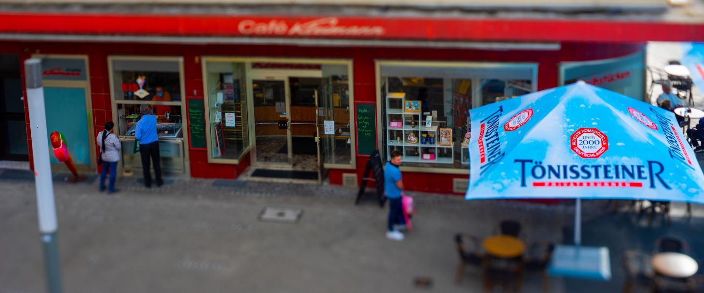

# Kleimann Cafe Website

The main purpose of the project was to create a new design for [cafe-kleimann.de](cafe-kleimann.de).

This is an unsalaried project made in the close cooperation with the owner of the Cafe.

Technologies:

- HTML and pure CSS;
- Bootstrap;
- A bit of JS and PHP for functional needs.